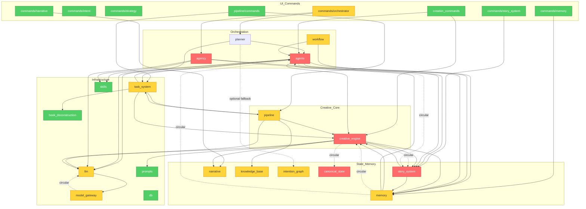

# Brooks-Lint Review

**Mode:** Architecture Audit
**Scope:** StoryMoss（StoryForge）智能创作流程 — `src-tauri/src` 中 `commands/orchestrator`、`agents`、`agency`、`creative_engine`、`pipeline`、`workflow`、`task_system`、`narrative`、`story_system`、`memory`、`intention_graph`、`knowledge_base`、`llm`、`model_gateway` 及其交互
**Health Score:** 0/100
**Trend:** 18 → 0 (−18) over last Architecture Audit run（注：本次聚焦智能创作流程，范围更窄）

智能创作流程已成为整个后端中耦合最深、概念完整性受损最严重的区域；四种并行的执行/编排层、两套 Agent 框架、以及多处跨模块循环依赖，使得任何新功能都需要同时修改多个子系统。

---

## Module Dependency Graph

---

## Findings

### 🔴 Critical

**Dependency Disorder — Domain/infrastructure module cycles in the creation core**
Symptom: `creative_engine/context_builder.rs` calls `story_system::StorySystemEngine::get_runtime_contract` (`src-tauri/src/creative_engine/write_time_bundle.rs:79`)；`story_system/scene_service.rs` imports `creative_engine::cascade_rewriter::EntityMentionRepository` 与 `EntityMention`；`creative_engine/asset_snapshot.rs` calls `canonical_state::CanonicalStateManager`；`canonical_state/manager.rs` 反向调用 `creative_engine::payoff_ledger::PayoffLedger` 与 `ForeshadowingTracker`；`agents/service.rs` 与 `agents/orchestrator.rs` 使用 `story_system::preflight/auto_contract`，而 `story_system/scene_service.rs` 反向引用 `agents::orchestrator::BACKGROUND_LLM_SEMAPHORE`。
Source: Robert C. Martin — *Clean Architecture*，Acyclic Dependencies Principle (ADP) / Dependency Inversion Principle (DIP)
Consequence: 创作核心无法独立编译、测试或替换；修改 `story_system` 的合约逻辑会倒逼 `creative_engine` 与 `agents` 同时改动，变更半径不可控。
Remedy: 将共享类型（`RuntimeContract`、`EntityMention`、`Foreshadowing`、并发信号量）下沉到 `domain/` 或新建 `creation_common/` 中性层；业务模块之间只通过 trait/port 交互，禁止直接引用对方具体实现。

**Dependency Disorder — Two competing agent frameworks (legacy `agents/` and Genesis 2.0 `agency/`)**
Symptom: `handlers.rs` 同时注册了 `agents::commands::auto_write/auto_revise/agent_execute_stream` 与 `agency::commands::agency_start_genesis/continue_chapter/continue_batch`；`agents/service.rs` 3857 行实现单 Agent 派发，`agency/coordinator.rs` 7004 行实现黑板式多 Agent ReAct 循环；两者都向 `scenes` 表写入生成结果，却各自维护取消注册、进度事件、审计/学习路径。
Source: Frederick Brooks — *The Mythical Man-Month*，Conceptual Integrity
Consequence: 同一用户意图（“继续写”/“生成下一章”）存在两套命令词汇与两条独立实现；新增创作模式需要在 `agents/orchestrator.rs` 与 `agency/coordinator.rs` 中分别实现，维护成本翻倍，行为极易分叉。
Remedy: 明确前端只暴露一种创作语义（例如保留 `smart_execute` 作为唯一入口），将 `agency/` 或 `agents/` 之一降维为后台实现细节；制定迁移计划，统一取消、进度、审计、记忆回写入口。

**Domain Model Distortion — Scene/Chapter truth source split and character state scattered across tables**
Symptom: `commands/chapter.rs:60` 注释称 “Scene 为真相源”，但 `db/models.rs:1162` 仍保留 `Chapter.content`；`update_chapter` 将内容写入关联 `Scene` 却又同时维护 `Chapter` 行；角色状态同时存在于 `characters.cs_*` 字段、`character_states` 表、`kg_entities` 表与 `narrative_chunks`/`conflict_escalations` 遗留模型中；“Entity” 在 `domain::narrative_elements`、`kg_entities`、`cascade_rewriter::EntityMention` 中含义各不相同。
Source: Eric Evans — *Domain-Driven Design*，Ubiquitous Language / Bounded Context
Consequence: 数据一致性无法保证，保存/回滚/同步逻辑复杂且容易出错；开发者无法凭模块名称判断“真实内容到底存在哪张表”，迁移与修复成本极高。
Remedy: 以 `Scene` 为唯一真相源，删除 `Chapter.content` 及相关兼容字段；将角色状态收敛到单一模型（建议 `kg_entities` + 专用状态视图），删除 `character_states` 与 `cs_*` 重复列；统一 `Entity` 命名空间或加前缀区分领域概念。

**Cognitive Overload — God files in the creation path**
Symptom: `agency/coordinator.rs` 7004 行、`agents/orchestrator.rs` 4588 行、`agents/service.rs` 3857 行、`llm/service.rs` 3324 行、`creative_engine/style/classic_styles_extended.rs` 3320 行、`creative_engine/context_builder.rs` 2217 行。这些文件混合路由、LLM 调用、DB 访问、进度事件、取消/重试、业务规则与测试。
Source: Martin Fowler — *Refactoring*，Long Method / Large Class；Steve McConnell — *Code Complete*，Ch. 7: High-Quality Routines
Consequence: 没有单个开发者能在工作记忆中装下整份协调器；任何局部修改都需要阅读数千行上下文，引入回归的风险极高，重构被长期阻塞。
Remedy: 按职责纵向拆分：`agency/coordinator.rs` 拆出 run lifecycle、tool loop、checkpointing、learning/promotion；`agents/service.rs` 按 AgentType 拆分为独立模块；`agents/orchestrator.rs` 按 `GenerationMode` 拆分为策略对象；`llm/service.rs` 拆出缓存、流式、取消、metrics、适配器。

### 🟡 Warning

**Dependency Disorder — Four overlapping execution substrates without clear ownership**
Symptom: 同一类 AI 工作可通过 `commands/orchestrator::smart_execute`（planner/agency）、`workflow/scheduler` DAG 节点、`pipeline/commands` 同步命令、`task_system` 异步 executor 至少四种路径触发；`pipeline/commands.rs` 甚至创建 `task_system` 任务仅作进度跟踪，然后直接调用 `refine_draft/review_draft/finalize_draft` 绕过调度器。
Source: Brooks — *The Mythical Man-Month*，Conceptual Integrity；John Ousterhout — *A Philosophy of Software Design*，Information Leakage
Consequence: 进度事件、超时、重试、取消逻辑在多个层重复实现；排查“为什么一次生成没跑起来”需要跨四个子系统追踪。
Remedy: 选定唯一通用调度器（建议保留 `task_system` 并删除其内部域专属 executor），将 `workflow`、`pipeline`、`agency` 的运行时统一表达为 `TaskExecutor` 或 `TaskPlan`；`pipeline/commands` 不再直接执行业务逻辑。

**Dependency Disorder — Circular reference between `llm` and `model_gateway`**
Symptom: `llm/service.rs:547` 从 Tauri state 获取 `model_gateway::executor::GatewayExecutor` 并构造 `model_gateway::types::GatewayRequest`；`model_gateway/executor.rs:19` 与 `:1395` 反向导入 `llm::{adapter::GenerateRequest, service::LlmService, GenerateResponse}`。
Source: Martin — *Clean Architecture*，ADP
Consequence: 两个基础设施模块无法独立理解或测试；LLM 调用链路中的路由逻辑与协议适配逻辑互相纠缠。
Remedy: 在 `ports/llm.rs` 定义 `GenerationPort`，`model_gateway` 实现该 port；`llm/service.rs` 只依赖 `ports/` 中的 trait，不再直接引用 `model_gateway` 模块。

**Change Propagation — `agency/` bypasses `CreativeEnginePort` and rebuilds context gathering**
Symptom: `agency/tools.rs` 通过 `StoryInfoTool` / `AssetQueryTool` 在 ReAct 循环中自行组装故事上下文，未使用 `domain::creative_engine::CreativeEnginePort`、`WriteTimeBundle`、`prompt_synthesis` 或 `context_builder`。
Source: Ousterhout — *A Philosophy of Software Design*，Information Leakage；Martin Fowler — *Refactoring*，Feature Envy
Consequence: 故事上下文构建逻辑被复制到两个地方；当 `creative_engine` 增加新约束（如 `reader_promise`、`payoff_ledger`）时，`agency` 的生成质量会 silently 落后。
Remedy: 让 `agency` 的 context tool 委托给 `CreativeEnginePort` 或 `WriteTimeBundle`；若需要 Blackboard 专用格式，则在 adapter 层做转换，不重新实现领域逻辑。

**Knowledge Duplication — Foreshadowing / payoff / thread tracking implemented in three places**
Symptom: `creative_engine/foreshadowing.rs`、`creative_engine/payoff_ledger.rs`、`narrative/thread.rs` / `narrative/thread_tracker.rs`、`story_system` 的 `foreshadowing_tracker` 表与 `character_states` 表都在处理“伏笔/ payoff/叙事线索”这一同一领域概念；`commands/narrative::get_narrative_threads` 只读 `ForeshadowingTracker`，使 UI 中“线索”与底层多处存储语义不一致。
Source: Martin Fowler — *Refactoring*，Duplicate Code；Andrew Hunt & David Thomas — *The Pragmatic Programmer*，DRY
Consequence: 同一概念在不同模块中命名、状态机、过期规则不同，导致 UI 显示的线索与创作引擎使用的约束不同步。
Remedy: 在 `domain::narrative_elements` 定义统一的 `ForeshadowingElement` / `Thread` 模型；由单一服务（建议并入 `story_system` 作为“合约-执行”真源）负责读写，其他模块只读该服务。

**Domain Model Distortion — Anemic domain layer with logic pushed to services**
Symptom: `domain/mod.rs:11` 明确要求“不承载复杂业务逻辑，行为应下沉到对应领域服务”；结果 `domain::creative_engine.rs` 仅定义 `CreativeEnginePort`，所有行为留在 `creative_engine/*` service 文件；`domain::agent_service.rs:7` 与 `domain::creative_engine.rs:8` 的 trait 签名直接依赖 `tauri::AppHandle`。
Source: Eric Evans — *Domain-Driven Design*，Anemic Domain Model；Robert C. Martin — *Clean Architecture*，DIP
Consequence: 业务规则散落在 `story_system`、`memory`、`creative_engine`、`agents` 的 service 中，边界模糊；`domain/` 成为 DTO 仓库，而非可测试的领域模型层。
Remedy: 将无 side-effect 的业务规则（如合约 fulfillment、上下文预算、payoff 检测）迁移到 `domain/` 的纯函数/值对象中；将 `AppHandle` 从 trait 中移除，改为注入 `DbPool`、`LlmPort` 等具体依赖。

**Accidental Complexity — Dormant or underutilized sophisticated modules**
Symptom: `workflow/` 在 `lib.rs:493` 初始化并注册标准模板，但前端仅暴露 `list_workflows`/`reload_workflows`，无创建/运行实例命令；`intention_graph` 启动时同步全量资产并预热缓存，但 `planner/executor.rs:48` 仅将其作为可选 fallback；`knowledge_base/commands.rs` 定义四个 Tauri 命令却均未在 `handlers.rs` 注册。
Source: Frederick Brooks — *The Mythical Man-Month*，Second-System Effect；Martin Fowler — *Refactoring*，Speculative Generality
Consequence: 启动耗时、编译耗时、认知负担增加；开发者面对大量“看起来很重要但无人使用”的模块，难以判断改动影响面。
Remedy: 对 `workflow` 与 `intention_graph` 制定“上线或下线”决策：要么接入 `smart_execute` 主路径，要么标记为 experimental 并在 CI 中跳过；对 `knowledge_base` 命令要么注册给前端使用，要么删除并合并到 scene/commit ingest 路径。

**Cognitive Overload — `Agent` trait is effectively dead while logic lives in monolithic match arms**
Symptom: `agents/mod.rs:43` 定义 `Agent` trait，但仅 `CommentatorAgent` 与 `PlotComplexityAgent` 真正实现；`Writer`、`Inspector`、`OutlinePlanner` 等主 agent 全部在 `agents/service.rs:251` 的 giant `match` 中实现；`agents/service.rs:3311` 的 `get_available_agents` 命令未在 `handlers.rs` 注册。
Source: Martin Fowler — *Refactoring*，Speculative Generality / Refused Bequest
Consequence: 新 agent 不知道该扩展 trait 还是该在 `service.rs` 加分支；`Agent` 抽象对维护者造成误导。
Remedy: 删除未使用的 `Agent` trait，或将所有 agent 真正重构为 trait 实现；清理 `agents/commands.rs` 中未注册的 dead commands。

### 🟢 Suggestion

**Cognitive Overload — Dead commands and `#[allow(dead_code)]` hide rot**
Symptom: `agents/commands.rs` 中的 `agent_execute`、`writer_agent_execute`、`agent_get_status` 未在 `handlers.rs` 注册；`agents/mod.rs`、`creative_engine/style/mod.rs`、`model_gateway/mod.rs`、`llm/mod.rs` 等大量使用 `#[allow(unused_imports)]` 与 `#[allow(dead_code)]`。
Source: Steve McConnell — *Code Complete*，Ch. 24: Refactoring
Consequence: 编译器无法帮助发现已废弃代码，dead code 与 live code 混杂。
Remedy: 移除未注册命令；分阶段删除 `allow` attributes，让编译器反馈真实未使用符号，然后清理。

**Cognitive Overload — Stale comments contradict implementation**
Symptom: `workflow/scheduler.rs:423` 注释声明“Workflow 节点嵌套 Orchestrator，禁止直接调用 Writer Agent”，但同文件仍直接构造 `AgentOrchestrator` 并调用 `generate(..., GenerationMode::Full)`；`task_system/repository.rs:484` 注释与实际 cron 解析逻辑不符。
Source: Hunt & Thomas — *The Pragmatic Programmer*，DRY / Orthogonality（文档与代码不一致）
Consequence: 新开发者按注释理解架构会做出错误决策。
Remedy: 修改或删除过时注释；在关键不变量处添加单元测试，用测试代替注释作为文档。

**Domain Model Distortion — `Chapter.content` and `Scene.content` coexist as a workaround**
Symptom: `db/models.rs:1162` 保留 `Chapter.content`，而 `commands/chapter.rs` 注释解释 Scene 为真相源，写入时需要双写/兼容。
Source: Eric Evans — *Domain-Driven Design*，Ubiquitous Language
Consequence: 任何 chapter 写入操作都需理解历史兼容逻辑。
Remedy: 在下一版数据迁移中删除 `Chapter.content`，用数据库视图或应用层投影满足遗留读取需求。

**Cognitive Overload — `TaskType` is a closed enum forcing central edits for new jobs**
Symptom: `task_system/models.rs` 将 `TaskType` 定义为封闭枚举（`BookDeconstruction`、`CascadeRewrite`、`AiGeneration`、`PipelineReview`、`AsyncAudit`、`DeepInsight`、`Custom`），新增业务任务必须修改该核心文件。
Source: Robert C. Martin — *Clean Architecture*，Open/Closed Principle
Consequence: 业务演进持续冲击通用调度器。
Remedy: 将 `TaskType` 改为字符串标签 + 注册表，或引入 trait object/插件注册机制，让新 executor 自注册而不改 `task_system`。

---

## Summary

StoryMoss 的智能创作流程已经从“一个 Agent 调用 LLM”演化成由 `agents`、`agency`、`planner`、`workflow`、`pipeline`、`task_system` 六层共同参与的复杂网络。本次聚焦审计发现：4 处 Critical、8 处 Warning、4 处 Suggestion，Health Score 0/100。最严重的不是单点代码质量问题，而是**概念完整性崩溃**——同一创作意图存在多条实现路径，同一领域概念（scene/chapter、entity、foreshadowing）存在于多个表与模块中，核心模块之间还存在循环依赖。

短期最优先的行动是：**切断 `creative_engine` ↔ `story_system` / `canonical_state` 的循环依赖**，并将 `Chapter.content` 等历史遗留字段清理掉；中期必须**在 `agents/` 与 `agency/` 之间二选一**，把创作语义收敛到单一入口；长期需要**把分散在 service 中的业务规则收回到 `domain/`**，让 `task_system` 成为唯一通用执行层。

---

## Optimization Roadmap（优化方案）

### Phase 1 — 止血（1–2 周）

目标：打破循环依赖，停止架构继续恶化。

1. **提取共享类型到 `domain/`**
   - 将 `RuntimeContract`、`EntityMention`、`Foreshadowing`、`Payoff`、`BACKGROUND_LLM_SEMAPHORE` 等被双向引用的类型/常量移入 `domain/` 或新建 `creation_common/`。
   - 文件：`domain/contracts.rs`、`domain/foreshadowing.rs`、新增 `domain/concurrency.rs`。

2. **删除或注册 dead surface**
   - 删除 `agents/commands.rs` 中未注册的 `agent_execute`、`writer_agent_execute`、`agent_get_status`。
   - 决定 `knowledge_base` 四个命令的命运：若 2 周内不接入前端，则删除命令文件并合并 `import_text` 到 scene/commit ingest。

3. **清理历史数据字段**
   - 编写迁移脚本删除 `Chapter.content` 列，将现有数据迁移到对应 `Scene.content`。
   - 删除 `characters.cs_*` 重复列或迁移到 `character_states`/`kg_entities` 统一视图。

4. **拆分最大文件的第一步**
   - 将 `agency/coordinator.rs` 中的测试代码（约 2000+ 行）抽到 `agency/tests/`。
   - 将 `classic_styles_extended.rs` 按文体/作者拆分为数据文件或独立模块。

### Phase 2 — 统一执行层（2–4 周）

目标：把“怎么调度 AI 工作”收敛到单一机制。

1. **`task_system` 成为唯一通用调度器**
   - 将 `task_system/audit_executor.rs`、`auto_rewrite_executor.rs`、`insight_executor.rs` 中的业务逻辑迁回 `audit/`、`creative_engine/`、`reading_power/`，仅保留 executor 适配壳。
   - 把 `workflow` 的 DAG 节点表达为 `TaskPlan`（子任务列表），由 `task_system` 执行；`workflow` 退化为 DSL 解析/可视化层。
   - `pipeline/commands.rs` 不再直接调用 `refine_draft/review_draft/finalize_draft`，而是创建 `TaskType::PipelineReview` 任务并返回 task_id。

2. **统一取消、进度、重试语义**
   - 定义 `TaskLifecycleEvent` 枚举（Started/Progress/Completed/Failed/Cancelled）。
   - `agents/orchestrator.rs`、`agency/coordinator.rs`、`pipeline/`、`workflow/` 统一通过 `task_system` 的事件总线向前端发送事件，不再各自发明 IPC 事件名。

3. **`intention_graph` 决策**
   - 要么让 `planner/executor.rs` 默认走 `IntentionGraphPlanner`（删除 legacy PlanGenerator fallback），要么将 `intention_graph` 标记为 experimental 并从启动同步中移除。

### Phase 3 — 统一 Agent 框架（4–6 周）

目标：前端只暴露一种创作语义，后台只剩一套可扩展的 agent runtime。

1. **二选一：保留 `agency/` 还是 `agents/`？**
   - 推荐保留 `agency/`（黑木板 + ReAct + learning）作为长期框架，因为它有清晰的 producer/lead-writer/editor-auditor 角色与学习闭环。
   - 将 `agents/service.rs` 中的高频能力（Writer、Inspector、OutlinePlanner、StyleMimic）迁移为 `agency` 的 tool 或 role。

2. **让 `agency` 复用 `CreativeEnginePort`**
   - 新增 `StoryContextTool` 内部委托 `CreativeEnginePort::build_context` / `WriteTimeBundle::load_sync`，将结果映射到 Blackboard zone。
   - 删除 `StoryInfoTool` / `AssetQueryTool` 中重复的领域逻辑。

3. **统一上下文构建**
   - 将 `context_builder.rs` 打造为所有创作路径的唯一上下文来源。
   - `agents/orchestrator.rs` 与 `agency/coordinator.rs` 均通过 `CreativeEnginePort` 获取上下文，仅在各自层添加模式特定的包装（TriShot、ReAct、time-sliced）。

### Phase 4 — 领域模型重构（6–10 周）

目标：把业务规则从 service 文件中收回 domain，消除贫血模型。

1. **富化 `domain/`**
   - `RuntimeContract` 自身提供 `fulfills(contract, scene)` 判断。
   - `Foreshadowing` / `Payoff` 值对象提供 `is_overdue`、`is_resolved` 方法。
   - `ContextBudget` 提供 `allocate(memory_pack, style, methodology)` 纯函数。

2. **统一实体模型**
   - 以 `kg_entities` 为唯一实体真源，Character/Location/Item 均作为 `kg_entities` 的 type 字段或子表。
   - `studio_commands` 的 entity CRUD、`cascade_rewriter::EntityMention`、`memory/facade` 统一读取 `kg_entities`。
   - 删除 `NarrativeStructurePosition`、`ConflictEscalation`、`NarrativeChunk` 等已废弃模型。

3. **统一伏笔/线索/ payoff 模型**
   - 合并 `creative_engine/foreshadowing.rs`、`creative_engine/payoff_ledger.rs`、`narrative/thread*.rs`。
   - 新模块 `domain::foreshadowing` + `story_system::foreshadowing_service` 作为唯一真源。

### Phase 5 — 基础设施解耦（并行进行）

1. **LLM / Model Gateway 解循环**
   - `ports/llm.rs` 定义 `LlmPort` trait（`generate(request) -> stream`）。
   - `model_gateway` 实现 `LlmPort`，`llm/service.rs` 只依赖 `LlmPort`。
   - `llm/service.rs` 不再直接引用 `model_gateway` 类型。

2. **移除 `tauri::AppHandle` 出 `domain/`**
   - 将 `AppHandle` 从 `CreativeEnginePort`、`AgentService` trait 中移除，改为由 composition root 注入 `DbPool`、`Arc<dyn LlmPort>`、`Arc<dyn VectorStore>`。

3. **测试接缝补全**
   - 为 `CreativeEnginePort`、`LlmPort`、`VectorStore`、`IngestPort` 提供内存/假实现。
   - 核心创作路径（context build → prompt synthesis → LLM call → post-process）必须能在不启动 Tauri、不连真实模型的情况下单元测试。

### 度量指标

- **循环依赖数**：从当前 6 个模块级循环降到 0（通过 `cargo modules` 或 `cargo tree` 检测）。
- **God file 数量**：>2000 行的文件从 10+ 降到 ≤3。
- **创作入口数**：前端创作相关命令从当前 20+ 收敛到 ≤5（`smart_execute`、`agency_start_genesis`、`run_refine`、`run_review`、`run_finalize`）。
- **单元测试覆盖率**：`domain/` 与 `creative_engine/` 核心路径达到 ≥60% 行覆盖，且无需启动 Tauri。
- **Health Score**：目标在 3 个月内从 0 提升到 ≥50，6 个月内 ≥70。
