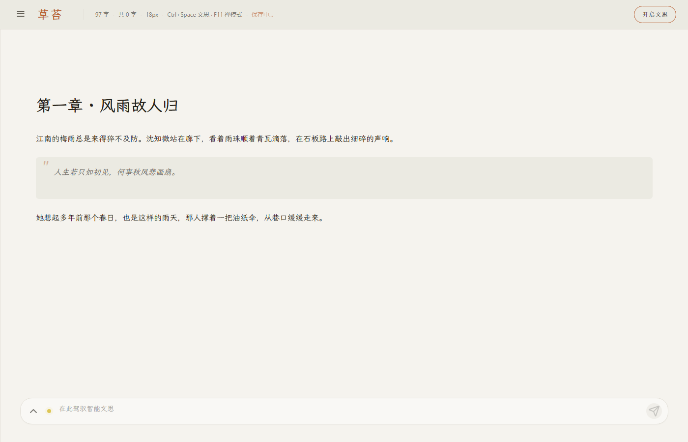

# StoryForge (草苔) v3.0 - Rust Implementation

> 🌿 越写越懂的创作系统 - AI 辅助小说创作桌面应用

## 🎭 独具特色的双界面设计

StoryForge 独创**"幕前 - 幕后"**双界面架构，让创作与阅读完美融合：

### 🎬 幕前 (Frontstage) - 沉浸式阅读写作

**设计理念**：像阅读一本精美小说一样写作

- **OKLCH 暖色纸张** - 感知均匀的色彩系统，`oklch(96.5% 0.008 95)` 暖色调背景，护眼舒适
- **霞鹜文楷正文字体** - 采用 LXGW WenKai 作为正文字体，中文排版优雅，去除通用字体的"AI 感"
- **大字号阅读体验** - 18px 正文字号，1.8 倍行距，久写不累
- **顶部动态状态栏** - 字数、字号、快捷键提示、保存状态一目了然
- **底部 LLM 对话栏** - 悬停显示，集成模型状态灯，去除多余图标保持极简
- **AI 流式续写** - Ctrl+Space 开启「文思」，文字如泉水般涌现
- **禅模式** - F11 快捷键进入全屏沉浸，专注创作无干扰
- **后台设置同步** - 写作风格、字体设置在后台统一管理
- **精简侧边栏** - 仅保留「幕后」切换按钮，120px 极简设计
- **右键上下文菜单** - 编辑器内右键唤起，支持剪切/复制/粘贴、修订模式、文本批注、评论线程、生成古典评点、全选



### 🔧 幕后 (Backstage) - 全能创作工作室

**设计理念**：专业作家的数字工作台

- **故事管理** - 多故事、多场景结构化组织
- **角色管理** - 角色卡片、关系图谱、性格追踪
- **场景化叙事** - 以场景为单位的戏剧冲突驱动
- **知识图谱** - AI 自动构建的故事世界知识库
- **技能系统** - AI 技能插件，扩展无限可能
- **版本控制** - 场景历史，随时回溯
- **数据导出** - 支持 PDF、EPUB、Markdown 等多种格式


### 🔄 双窗口无缝协作

| 功能 | 幕前 | 幕后 |
|------|------|------|
| 阅读写作 | ✅ 沉浸式体验 | - |
| 故事管理 | - | ✅ 完整功能 |
| 场景管理 | ✅ 快速切换 | ✅ 详细编辑 |
| AI 续写 | ✅ 流式生成 | ✅ 参数调节 |
| 角色查看 | ✅ 卡片式预览 | ✅ 完整编辑 |

**快捷键对照**：
- `F11` - 幕前禅模式切换
- `Ctrl+Space` - 开启/关闭 AI 文思
- `Tab` - 接受 AI 建议
- `Esc` - 拒绝 AI 建议

---

## ✨ v3.0 核心新特性

### 🎪 场景化叙事架构

**从"章节"到"场景"** - 以戏剧冲突为核心的叙事单位：

- **戏剧目标** - 每个场景都有明确的叙事使命
- **外部压迫** - 环境、反派、事件对角色的压迫
- **冲突类型** - 人与人/人与自我/人与社会/人与自然/人与科技/人与命运
- **角色冲突** - 角色间的利益、价值观、情感冲突
- **故事线视图** - 可视化场景序列，支持拖拽排序

### 🧠 增强记忆系统（基于 llm_wiki）

**真正的"越写越懂"** - AI 深度理解你的故事世界：

- **CJK 二元组分词** - 针对中文优化的语义检索
- **两步思维链 Ingest** - 分析→生成，提取实体、关系、事件
- **带权知识图谱** - 实体关系带强度评分，优先级排序
- **四阶段查询检索** - 分词搜索→图谱扩展→预算控制→上下文组装
- **多助手独立会话** - 世界观/人物/文风/情节助手，各持独立 Wiki

### 🤖 AI 智能生成小说要素

**引导式创作** - 从零开始构建你的故事世界：

- **新建小说向导** - 4 步引导：类型→世界观→角色→文风
- **灰色提示词** - "小说类型：玄幻...商战...或随便定"
- **卡片式选择** - AI 生成 3 个选项，单击选择，双击编辑
- **世界构建生成** - 基于类型生成宏观世界观概念
- **角色谱生成** - 基于世界观生成角色配置
- **文风生成** - 匹配类型和世界观的写作风格

### 📦 工作室配置导入/导出

**每部小说独立配置** - 随身携带你的创作工作室：

- **独立工作室** - 每部小说拥有独立的 LLM/UI/Agent 配置
- **ZIP 导出** - `.storyforge` 格式，包含所有配置和数据
- **选择性导入** - 勾选需要导入的配置模块
- **冲突处理** - 智能检测同名小说，提示覆盖或重命名

---

## 📊 项目状态概览

**当前版本**: v3.1.2  
**最后更新**: 2026-04-13  
**GitHub**: https://github.com/91zgaoge/StoryForge  
**整体完成度**: ~99%

> 🪶 品牌图标：Lucide `feather`（羽毛笔）—— 来自 [iconbuddy.com](https://iconbuddy.com)，象征创作与文学

| 模块 | 状态 | 完成度 |
|------|------|--------|
| 核心架构 | ✅ 稳定 | 100% |
| 场景化系统 | ✅ 完成 | 100% |
| 记忆系统 | ✅ 完成 | 95% |
| AI 生成 | ✅ 完成 | 100% |
| 知识图谱 | ✅ 完成 | 90% |
| 工作室配置 | ✅ 完成 | 100% |
| 双界面设计 | ✅ 完成 | 100% |
| LLM 集成 | ✅ 完成 | 100% |
| 本地模型配置 | ✅ 完成 | 100% |
| Agent 系统 | ✅ 完成 | 95% |
| 技能系统 | ✅ 完成 | 100% |
| 前端界面 | ✅ 完成 | 100% |
| 桌面构建打包 | ✅ 完成 | 100% |

---

## 🗂️ 项目结构

```
v2-rust/
├── src-frontend/                 # 前端代码 (React + TypeScript)
│   ├── src/
│   │   ├── main.tsx             # 幕后入口
│   │   ├── App.tsx              # 幕后主应用
│   │   ├── frontstage/          # 幕前界面
│   │   ├── pages/               # 幕后页面
│   │   │   ├── Dashboard.tsx    # 仪表盘
│   │   │   ├── Stories.tsx      # 故事库
│   │   │   ├── Characters.tsx   # 角色管理
│   │   │   ├── Scenes.tsx       # 🆕 场景管理
│   │   │   └── Settings.tsx     # 设置中心
│   │   ├── components/          # 共享组件
│   │   │   ├── StoryTimeline.tsx    # 🆕 故事线视图
│   │   │   ├── SceneEditor.tsx      # 🆕 场景编辑器
│   │   │   └── NovelCreationWizard.tsx # 🆕 创建向导
│   │   └── hooks/               # 自定义 Hooks
│   │       ├── useScenes.ts         # 🆕 场景管理
│   │       ├── useWorldBuilding.ts  # 🆕 世界构建
│   │       └── useStudioConfig.ts   # 🆕 工作室配置
│   ├── index.html               # 幕后HTML
│   ├── frontstage.html          # 幕前HTML
│   └── package.json
│
├── src-tauri/                   # Tauri后端 (Rust)
│   ├── src/
│   │   ├── main.rs              # 应用入口
│   │   ├── lib.rs               # 库入口
│   │   ├── commands.rs          # Tauri命令
│   │   ├── commands_v3.rs       # 🆕 V3命令集
│   │   │
│   │   ├── db/                  # 数据库层
│   │   │   ├── models_v3.rs     # 🆕 V3数据模型
│   │   │   └── repositories_v3.rs # 🆕 V3存储层
│   │   │
│   │   ├── agents/              # Agent系统
│   │   │   └── novel_creation.rs # 🆕 小说创建Agent
│   │   │
│   │   ├── memory/              # 🆕 记忆系统
│   │   │   ├── tokenizer.rs     # CJK分词器
│   │   │   ├── ingest.rs        # Ingest管线
│   │   │   ├── query.rs         # 查询检索管线
│   │   │   └── multi_agent.rs   # 多助手会话
│   │   │
│   │   └── config/              # 配置管理
│   │       └── studio_manager.rs # 🆕 工作室配置管理
│   │
│   ├── Cargo.toml
│   └── tauri.conf.json
│
├── docs/                        # 文档
└── README.md
```

---

## 🎨 前端双界面架构

### 技术栈
- **React 18** - UI 框架
- **Vite 6** - 构建工具，支持多入口
- **TypeScript** - 类型安全
- **Tauri** - 桌面应用框架
- **@dnd-kit** - 拖拽排序

### 核心组件

#### 🆕 RichTextEditor - 幕前富文本编辑器
集成 TipTap 编辑器与 LLM 对话栏：
- 角色卡片 `@` 提及弹窗
- 底部对话栏悬停显示
- 模型状态灯与流式对话

#### 🆕 StoryTimeline - 故事线视图
可视化场景序列，支持拖拽重新排序：
- 场景卡片展示戏剧目标、冲突类型
- 拖拽手柄调整场景顺序
- 点击选择场景进行编辑

#### 🆕 SceneEditor - 场景编辑器
三标签页场景编辑：
- **基础信息** - 标题、场景设置、在场角色
- **戏剧结构** - 戏剧目标、外部压迫、冲突类型
- **内容编辑** - 富文本编辑器

#### 🆕 NovelCreationWizard - 创建向导
引导式小说创建流程：
- 类型输入（灰色提示词）
- 世界观选择（卡片式）
- 角色谱选择（卡片式）
- 文风选择（卡片式）

---

## ✅ 功能实现详情

### 1. 场景化叙事系统 (100% ✅)

| 功能 | 状态 | 说明 |
|------|------|------|
| Scene 模型 | ✅ | 戏剧目标、外部压迫、冲突类型 |
| SceneRepository | ✅ | CRUD + 重新排序 |
| 故事线视图 | ✅ | 拖拽排序、场景卡片 |
| 场景编辑器 | ✅ | 三标签页设计 |
| 冲突类型枚举 | ✅ | 6 种标准冲突类型 |

### 2. 记忆系统 (95% ✅)

| 功能 | 状态 | 说明 |
|------|------|------|
| CJK 分词器 | ✅ | 二元组分词，中日韩支持 |
| Ingest 管线 | ✅ | 两步思维链：分析→生成 |
| 知识图谱 | ✅ | 实体/关系带强度评分 |
| 查询检索 | ✅ | 四阶段检索管线 |
| 多助手会话 | ✅ | 6 种助手类型独立会话 |
| 混合搜索 | ✅ | BM25 + 向量融合 (RRF) |
| 场景版本 | ✅ | 版本历史、比较、恢复 |
| 记忆保留 | ✅ | 遗忘曲线、优先级管理 |

### 3. AI 智能生成 (100% ✅)

| 功能 | 状态 | 说明 |
|------|------|------|
| NovelCreationAgent | ✅ | 世界观/角色/文风生成 |
| 创建向导 | ✅ | 4 步引导流程 |
| 卡片式 UI | ✅ | 单击选择，双击编辑 |
| 首个场景生成 | ✅ | 完成创建后自动生成 |

### 4. 工作室配置 (100% ✅)

| 功能 | 状态 | 说明 |
|------|------|------|
| StudioConfig 模型 | ✅ | 每部小说独立配置 |
| ZIP 导出 | ✅ | `.storyforge` 格式 |
| ZIP 导入 | ✅ | 选择性导入、冲突处理 |
| 默认主题 | ✅ | 幕前暖色/幕后暗色 |

### 5. 本地模型与构建

| 模块 | 完成度 | 说明 |
|------|--------|------|
| 本地模型配置 | 100% | Gemma 多模态 / Qwen3.5 语言 / bge-m3 嵌入 |
| LLM 集成 | 100% | OpenAI/Anthropic/Ollama/本地 API |
| Agent 系统 | 95% | 5 种 Agent 完整实现 |
| 技能系统 | 100% | 内置 5 技能 + 扩展支持 |
| 向量检索 | 90% | TF-IDF + 语义检索 |
| 导出功能 | 100% | PDF/EPUB/Markdown |
| Tauri 打包 | 100% | MSI + NSIS 安装包 |

---

## 📅 更新历史

### v3.1.1 (2026-04-13) - 幕前 Waza 设计重构与 CI 修复

#### 🎭 幕前界面重构（Waza 原则落地）
- **OKLCH 颜色系统** - 全站颜色替换为 OKLCH，去除装饰性纹理与 AI 模板感
- **LXGW WenKai 字体** - 移除 Crimson Pro / Cormorant / Inter，统一为霞鹜文楷
- **精简侧边栏** - 仅保留「幕后」切换按钮，120px 极简宽度
- **顶部状态栏** - 字数、字号、快捷键、保存状态集中展示
- **底部 LLM 对话栏** - 悬停显示，集成模型状态灯，去除多余模式切换图标
- **流式对话** - Enter 发送，Shift+Enter 换行
- **微交互规范** - 全按钮 `active:scale-95`，清除 `transition: all` 反模式

#### 🤖 本地三模型配置
- **Gemma-4-31B** - 多模态对话模型
- **Qwen3.5-27B** - 语言模型（文思助手）
- **bge-m3** - Embedding 嵌入模型

#### 🖥️ Tauri 构建与 CI 修复
- 修复 Windows 下 `beforeBuildCommand` 路径兼容性问题
- 成功构建 MSI / NSIS 安装包
- 修复 GitHub Actions 跨平台构建缺少 `icon.icns` 的问题

### v3.1.0 (2025-04-13) - 智能记忆与版本管理

#### 🔍 混合搜索 (Phase 1.3)
- **BM25 + 向量融合** - RRF 融合排序，文本+语义双路检索
- **CJK 二元组分词** - 中文优化的高性能文本搜索
- **实体混合搜索** - 名称匹配 + 向量相似度

#### 📜 场景版本管理 (Phase 3.x)
- **版本历史** - 自动记录每次编辑，支持置信度评分
- **版本比较** - 行级差异对比，字数变化统计
- **一键恢复** - 恢复到任意历史版本，创建新版本记录
- **版本统计** - 编辑分布、平均置信度、字数变化

#### 🧠 记忆保留管理 (Phase 1.4)
- **艾宾浩斯遗忘曲线** - R(t) = R₀ × e^(-λt) + Σ(强化)
- **优先级分级** - Critical/High/Medium/Low/Forgotten 五级
- **自动归档建议** - 预测遗忘时间，智能清理建议

### v3.0.0 (2025-04-12) - 重大架构调整

#### 🎪 场景化叙事架构
- **Scene 取代 Chapter** - 以戏剧冲突为核心的叙事单位
- **戏剧结构** - 戏剧目标、外部压迫、冲突类型、角色冲突
- **故事线视图** - 可视化场景序列，拖拽排序
- **场景编辑器** - 三标签页专业编辑界面

#### 🧠 增强记忆系统
- **CJK 分词器** - 针对中文优化的二元组分词
- **两步 Ingest** - 分析→生成的思维链管线
- **知识图谱** - 带权实体关系图谱
- **四阶段查询** - 分词→扩展→预算→组装
- **多助手会话** - 世界观/人物/文风/情节/场景/记忆助手

#### 🤖 AI 智能生成
- **创建向导** - 4 步引导式小说创建
- **卡片式 UI** - 世界观/角色/文风卡片选择
- **智能生成** - 基于类型生成完整故事要素

#### 📦 工作室配置
- **独立配置** - 每部小说独立 LLM/UI/Agent 配置
- **导入/导出** - `.storyforge` ZIP 格式

### v2.0.0 (2025-04-12) - 双界面设计

#### 🎭 核心特性：幕前-幕后双界面架构
- 幕前界面 - 沉浸式写作，温暖纸张风格
- 幕后界面 - 专业工作室，暗色主题
- 双窗口通信 - 实时同步

### v1.5.0 (2025-04-08)

- Agent 系统完善
- 工作流引擎实现
- 向量存储实现

### v1.0.0 (2025-04-01)

- 基础架构搭建
- LLM 集成
- 数据库设计

---

## 🚀 快速开始

### 环境要求
- Rust 1.70+
- Node.js 18+ (前端开发)
- SQLite 3

### 开发模式

**快速启动（Windows PowerShell）**:
```powershell
# 一键启动前端和后端
.\start-dev.ps1
```

**手动启动**:
```bash
# 1. 克隆项目
cd v2-rust

# 2. 安装依赖
cd src-frontend && npm install && cd ..

# 3. 终端 1 - 启动前端开发服务器
cd src-frontend && npm run dev

# 4. 终端 2 - 启动 Tauri 应用
cd src-tauri && cargo tauri dev

# 5. 构建发布版本（Windows）
cd src-tauri && cargo tauri build

# 构建产物
# target/release/storyforge.exe          - 独立可执行文件
# target/release/bundle/msi/*.msi        - MSI 安装包
# target/release/bundle/nsis/*-setup.exe - NSIS 安装包
```

**双界面入口**:
- 幕前界面: http://localhost:5173/frontstage.html
- 幕后界面: http://localhost:5173/index.html
- Tauri 应用会自动打开两个窗口，幕前在前，幕后在后

**故障排除**: 参考 [TROUBLESHOOTING.md](TROUBLESHOOTING.md)

### 配置说明

配置文件位置：`~/.config/storyforge/config.json`

```json
{
  "llm": {
    "provider": "openai",
    "api_key": "your-api-key",
    "model": "gpt-4",
    "max_tokens": 4096,
    "temperature": 0.7
  }
}
```

---

## 🛣️ 路线图 (Roadmap)

### 已完成 (v3.0.0) ✅
- [x] **场景化叙事** - 场景取代章节，戏剧冲突驱动
- [x] **记忆系统** - 基于 llm_wiki 的知识图谱
- [x] **AI 智能生成** - 引导式小说创建
- [x] **工作室配置** - 导入/导出功能

### 短期计划 (v3.1.x)
- [x] 混合搜索 (BM25 + Vector)
- [x] 场景版本历史
- [x] 记忆保留曲线
- [x] 幕前界面重构（Waza / OKLCH / LXGW WenKai）
- [x] 本地模型配置
- [x] Tauri 构建打包
- [x] GitHub Actions CI 修复
- [ ] 知识图谱可视化
- [ ] 性能优化

### 中期计划 (v3.2.0)
- [ ] 云端同步
- [ ] 协作写作增强
- [ ] 插件市场
- [ ] 移动端适配

### 长期计划 (v4.0.0)
- [ ] WebAssembly 前端
- [ ] 自研小模型
- [ ] 多人实时协作
- [ ] 发布平台集成

---

## 📚 相关文档

- [架构设计](ARCHITECTURE.md) - 详细架构说明
- [功能清单](docs/FEATURES.md) - 完整功能列表
- [更新日志](CHANGELOG.md) - 版本变更记录
- [项目状态](PROJECT_STATUS.md) - 开发进度
- [V3 架构计划](docs/plans/ARCHITECTURE_V3_PLAN.md) - V3 详细设计

---

## 📄 许可证

MIT License - 详见 [LICENSE](LICENSE)

---

**StoryForge (草苔)** - 让创作更智能 🌿
