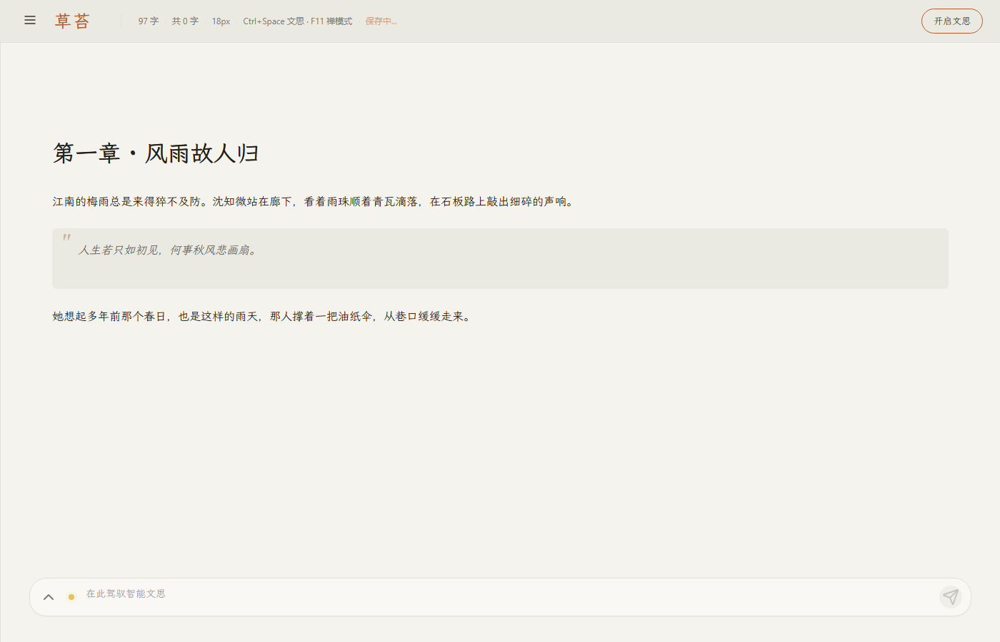
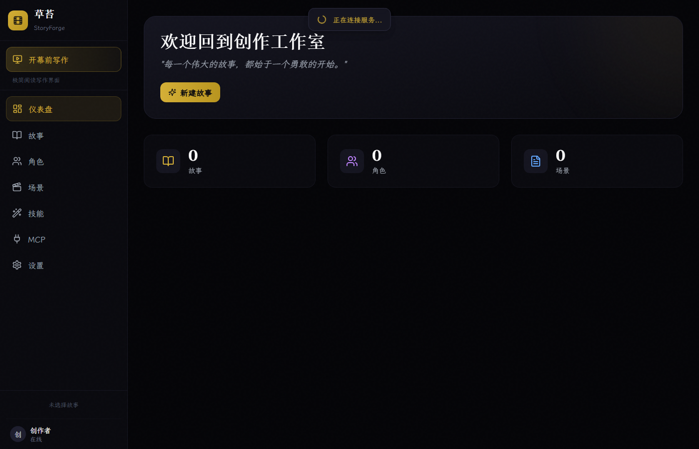

<p align="center">
  
</p>

<h1 align="center">StoryMoss · 草苔</h1>

<p align="center">
  🌿 <strong>越写越懂的 AI 小说创作桌面应用</strong><br/>
  幕后管理故事资产，幕前沉浸式写作，AI 在需要时随行辅助
</p>

<p align="center">
  <a href="./CHANGELOG.md"></a>
  <a href="./LICENSE"></a>
  <a href="https://github.com/91zgaoge/StoryMoss/actions/workflows/build.yml"></a>
  
  
  
  
</p>

---

## ✨ 核心特性

| | 特性 | 说明 |
| :---: | --- | --- |
| 🎬 | **双界面创作** | 幕前「墨纸」沉浸写作 + 幕后「机械」工作室管理，两套设计语言各得其所 |
| 🤖 | **Agency 多代理创作** | 主创 / 管理 / 编辑审计三代理黑板并行协作，每章经 Gate v2 四级 grader 质量门（阈值 0.75）才交付 |
| ⚡ | **分时介入架构** | 幕前续写走三角色主创、编辑审计后台化；划词改写仍可走完整质检——解开「质量与速度不可兼得」的根本矛盾 |
| 🧠 | **越写越懂你** | 持续学习：从创作事件观察模式 → 提炼 instinct → 确认后晋升为可复用技能 |
| 📝 | **PROBLEM 七元素** | 简单指令自动基于 Erik Bork 七元素增强为强力 Logline，驱动大纲与续写 |
| 🌍 | **资产强关联** | 世界观 / 故事大纲 / 场景大纲 / 用户指令四位一体显式调和，剧情不跑偏 |
| 🔄 | **资产回流** | 每章正文生成后自动提取角色 / 关系 / 世界观 / 大纲回流累积进资产库，手工编辑永不覆盖，续写越写越强关联 |
| 🔌 | **多模型适配** | OpenAI / Anthropic / Ollama / 本地 API，角色 × 任务模型路由 |
| 📚 | **全链路资产管理** | 角色 / 世界构建 / 场景 / 知识图谱 / 伏笔看板 / 叙事分析 / 拆书，AI 不「吃书」 |

---

## 📸 界面预览

<p align="center">
  
</p>

<p align="center"><em>幕前 · 极简全屏写作，AI 输入栏随行辅助，文思模式主动给萤火提示</em></p>

<p align="center">
  
</p>

<p align="center"><em>幕后 · 故事 / 角色 / 世界构建 / 场景 / 知识图谱 / 代理工作室等全套资产管理</em></p>

---

## 🚀 安装与运行

### 下载预构建版本

访问官网 `https://storymoss.top` 或 GitHub Releases 页面，下载对应平台安装包后直接安装即可。

### 从源码运行

需要安装 [Node.js](https://nodejs.org/)（推荐 20 LTS）和 [Rust](https://rustup.rs/)。
仓库通过 `rust-toolchain.toml` 固定 Rust 版本为 **1.95.0**，`rustup` 会自动下载对应工具链。

```bash
# 1. 克隆仓库
git clone https://github.com/91zgaoge/StoryMoss.git
cd StoryMoss

# 2. 安装前端依赖
cd src-frontend && npm install

# 3. 安装 Tauri CLI 并运行桌面应用
cd ..
npm install -g @tauri-apps/cli
cargo tauri dev
```

> **注意**：`Cargo.lock` 已纳入版本控制。如需升级依赖，请在本地验证 `cargo clippy` / `cargo test` 通过后再提交。

### 仅运行前端（开发调试）

```bash
cd src-frontend
npm run dev
```

然后在浏览器打开 `http://localhost:5173/`。

### 构建官网落地页

```bash
cd landing
npm install
npm run build
```

构建产物位于 `landing/dist/`，可部署到任意静态托管服务。开发模式运行 `npm run dev`，测试运行 `npm run test`。

---

## 🆕 最新动态

> 完整变更日志见 [`CHANGELOG.md`](./CHANGELOG.md)。

### v0.50.0 · 续写后能在工作室看见资产，审查意见会进下一拍

点续写后，幕后代理工作室会列出这一拍的人物和当前场大纲，卡片能点进去看。管理回流结束会显示完成或失败，不再停在「开始」。上一拍编辑指出的问题会成为下一拍必须兑现的任务。请升级到 0.50.0 并重启。同一开头的真机续写还没重跑，不能说「和前文唱反调」已经消失。

测试：`cargo test --lib` 1449 passed / 2 ignored（+13）；`npx vitest run` 590 passed / 3 skipped（+2）。

### v0.49.1 · 划词不再弹出润色条

选中正文时不再出现「润色 / 扩写 / 指令」浮条。需要改某一段时，在底部输入栏写指令。请升级到 0.49.1 并重启。

测试：`npx vitest run` 588 passed / 3 skipped（−17）。

### v0.49.0 · 续写跟着已经写下的章节走，不再按书名另起一套

有正文时不会再用书名去发明另一批主角和大纲。空着的创作方法会落成「场景结构」（目标→冲突→灾难）。管理补齐失败也不再把整次续写掐死。请升级到 0.49.0 并重启。同一开头的真机续写还没重跑，不能说「和前文唱反调」已经消失。

测试：`cargo test --lib` 1436 passed / 2 ignored（+18）。

### v0.48.1 · 划词润色条不再挡住打字

选中一段字才会出现润色/扩写；点光标或误划一两个字不会再弹出输入框。需要重启到 0.48.1。

测试：`npx vitest run` 605 passed / 3 skipped（+4）。

### v0.48.0 · 续写按镜头接着写，连续续写不再丢掉上一段

0.47.0 真机续写仍会把不在镜头里的人拉回来、用旧快照盖掉刚写的一段。本版「谁必须还在场」只看末几百字；连续点续写会先把未确认的灰色正文写进章节。真机 8 次还要在 0.48.0 上重跑，不能说人物错配和情节混乱已经修好。需要重启到 0.48.0。

测试：`cargo test --lib` 1418 passed / 2 ignored（+5）。

### v0.47.0 · 续写按拍兑现人物、冲突和进度

续写不再「卡上写了就算做过」。只有正文真的点名了冲突双方、换了人或换了场，才会清债务；过短时仍带着这一拍的任务重写，不会掉进创世开篇。真机连续 8 次幕前续写还没跑，不能说角色错配/推进慢/前后文断裂已经修好。需要重启到 0.47.0。

测试：`cargo test --lib` 1413 passed / 2 ignored（+22）。无前端逻辑变更。

### v0.46.0 · 十二套传统色，幕前幕后可分开选

幕前顶栏色点只改写作纸面；设置里左右两列分别选幕前 / 幕后。旧四套（暖赭/冷青/琥珀/靛紫）自动迁到朱红/群青/藤黄/黛紫。需要重启到 0.46.0。

测试：`npx vitest run` 601 passed / 3 skipped（+11）。无 Rust 逻辑变更。

### v0.45.1 · 续写会带上本章开篇和刚写到的近文

同一章写长了之后，续写不再只看最后几百字。短章全文都给模型；长章保留开头和最近写到的部分。需要重启到 0.45.1。

测试：`cargo test --lib` 1391 passed / 2 ignored（+6）。

### v0.45.0 · 发给模型的提示词有了统一组装入口

创世、续写、工具循环不再各写一套字符串拼接。幕后「提示词」页的场景预览改成真正在用的创世/续写路径，不再显示已经下线的分时/三击模板。

测试：`cargo test --lib` 1385 passed / 2 ignored（+18）；vitest 590 passed / 3 skipped。

### v0.44.1 · 输入框真正没有外框线

v0.44.0 拆掉了底栏卡片，但 macOS 还给输入框画一圈系统细线。本版去掉这圈原生描边，字直接写在纸面上。

测试：vitest 590 passed / 3 skipped（+1）。

### v0.44.0 · 输入条贴着纸面，幕后内芯不再发紫

幕前底栏去掉顶边和毛玻璃，输入区不再自成一张卡片。正文有独立的 Medium 字重文件。纸更暖，划词是半透明陶土而不是整块实心赭。幕后暖金面板内芯跟外壳同色相，折叠展开 500ms，侧栏选中只留金淡彩。

测试：vitest 589 passed / 3 skipped（+11）。

### v0.43.0 · 幕前输入条不再像聊天框

幕前底栏改成一层纸面：去掉双层边框和炭黑发射键，有字时陶土淡彩、空着时近乎隐形。取消键不再红闪。霞鹜文楷从本地加载，不再靠系统字体假装纸感。

测试：vitest 578 passed / 3 skipped（+22）。

### v0.42.0 · 续写只带上这一拍用得着的角色

长篇续写不再把整张角色表和堆叠大纲全灌进提示词。这一拍上场的人给完整人设（最多 8 人），其余本故事相关角色只留一行名单，从没出场过的脏名直接丢掉。

测试：cargo test 1367 passed / 2 ignored（+13）。对照诊断故事再续一拍的真机验收尚未跑。

### v0.41.2 · 续写不再卡满 10 分钟

续写提示太长时，会跳过上下文窗口不够的本地模型，不再空等报错。主创和散文回退都失败时会较快给出错误，而不是再转一圈工具循环顶满超时。

测试：cargo test 1354 passed / 2 ignored（+4）。

### v0.41.1 · Agency 续写上线核验加固

对照设计补齐：续写正文先清理思维链泄露，自重复过高会重试一次；划词改写不会误走同章追加，也不会再落到已删除的分时/三击续写引擎。文思活跃续写必须带当前章节 id。

测试：cargo test 1350 passed / 2 ignored（+5）；vitest 556 passed / 3 skipped。设计文档「连续 8 次续写真机探针」尚未跑，四症状痊愈不能算验收通过。

### v0.41.0 · Agency 唯一续写路径 + 幕前同章追加

创世与幕前/幕后续写只走三角色（主创 / 管理 / 编辑审计）。幕前续写和文思活跃会把新内容**追加到当前章**，不再每次开新章；划词改写方式不变。续写会按「这一拍必须完成的任务」推进剧情，并写回出场人物、冲突与地点。设置里的分时/三击不再控制续写。

测试：cargo test 1345 passed / 2 ignored（+17）；vitest 556 passed / 3 skipped。

### v0.38.1 · 修复续写伏笔账本多字节中文切片 panic（文思活跃模式）

文思活跃模式续写弹 Fatal `end byte index 30 is not a char boundary; it is inside '指'`：`foreshadowing_service.rs` 构造伏笔账本 title 预览时 `&content[..30]` 按字节切片，中文 content 的 byte 30 落在三字节字符内部 -> Rust UTF-8 panic -> 续写 bundle 加载失败。改为按字符数截取（`chars().take(30)`）；同类 `post_process.rs` 两处 + `intent.rs` 一处字节切片改 `floor_char_boundary`（保留字节预算，切点回退最近字符边界）。新增回归测试用报错原文验证不 panic。

测试：cargo test 1325 passed / 2 ignored（+1）；纯 Rust 修复。

### v0.38.0 · 代理工作室实时显示修复与三 Agent 完善

修复幕后代理工作室（AgencyStudio）未打开时创世/续写事件丢失、打开后空白等待的问题：事件监听从条件挂载的页面提升到常驻 `App.tsx` 顶层，新增全局 `agencyActivityStore` 缓存事件流（cap 200），页面未开不再丢实时动态，打开即见；跨故事切换时自动校正当前 run。同时补齐三 Agent（主创/管理/编辑审计）活动信号——概念/资产/首章/资产补齐/装配的开始与完成全路径配对，后台质检结论实时出现在看板；修复 legacy 概念完成信号角色标注；幕前文案动词映射补全，幕后时间线同源重复事件不再显示两次。续写熔断不丢稿行为经核实已由 v0.30.30 实现，本版补齐流程级测试。

测试：cargo test 1306 passed / 2 ignored（+5）；vitest 421 passed / 3 skipped（+17）。

### v0.37.0 · 资产回流：正文生成后资产自动累积

修复后台资产 agent（IngestPipeline）对已生成正文不发挥作用的问题：此前提取的角色/关系只写 kg 记忆层，续写 writer 只读生产资产表，两不相通；且提取 prompt 字段名与 schema 错配、新登场角色被丢弃、Agency 续写路径不跑提取。本版：提取 prompt 升级为写作级字段并与 schema 严格对齐（角色情感画像 / 双向情感关系 / 世界观增量 / 场景与故事大纲）；新增资产桥（`memory/asset_bridge.rs`）将提取结果 upsert 进生产资产表，新角色自动注册，源感知合并——只精炼机器来源，手工编辑永不覆盖；Agency 续写每章落库后后台自动跑提取（per-story 进程内锁 + 后台串行化，失败不致命）。生成任一章节后，角色卡/关系/世界观/场景大纲/故事大纲自动从正文回流累积，下一次续写即强关联。

测试：cargo test 1301 passed / 2 ignored（+14）；vitest 404 passed / 3 skipped（未动）。

### v0.30.46-48 · 创世持久化链路审计修复 + issue #13/#14/#15 批量修复

- **创世正文未即时保存与资产缺失（v0.30.46）**：前端创世后补偿保存；场景装配原子化 + 空正文防护；伏笔落库 + 资产别名归一化 + 角色 upsert。
- **角色谱静默失败 + llm_calls 空表（v0.30.47，issue #13/#14）**：角色谱/文风/首场景改健壮 JSON 解析 + 失败日志；修复 `prompt[..200]` 字节切片 panic 导致 llm_calls 永不落库；向导卡片防重入；拆书错误不再显示 `[object Object]`。
- **向导策略加载误报 + 快速创作空输入确认（v0.30.48，issue #15）**：策略加载中不再误显失败文案；空简介快速创作先确认。

测试：cargo test 1098 passed；vitest 352 passed；全绿。

### v0.30.45 · 修复文思活跃模式续写提示词泄露（LLM 思维链泄露到正文）

用户报告文思活跃模式续写返回的是 LLM 思维链推理而非小说正文。根因四层：①`openai.rs` 的 `resolve_content` 在 `content` 为空时错误回退到 `reasoning_content`（CoT），把思维链当正文返回；②`max_tokens: 2048` 对推理模型过小，CoT 耗尽全部 token 预算导致 `content` 恒为空、整段被 CoT 占据；③`sanitize_novel_output` 仅清洗 markdown/元评论，无法识别裸 CoT 思维链；④writer 提示词从未显式禁止推理输出。修复：移除 `reasoning_content` 回退；`max_tokens` 提升至 4096；新增 `detect_and_strip_bare_cot`（≥3 条 CoT 信号行触发剥离）；writer 提示词新增反推理指令。测试：cargo test 1091 passed（+4）；vitest 352 passed；clippy 539（零新增）；全绿。

### v0.30.44 · 修复文思活跃模式续写报"生成过程异常结束"

用户报告"开启了文思活跃模式后，出现了报错的诊断信息"。诊断数据显示 LLM 成功返回 2460 字符，但前端 `generatedText` 仅剩 3 字符，打字机动画被中断，最终弹出"生成过程异常结束，未收到有效内容"。根因：`smartExecuteInFlightRef.current = false` 在 smartExecute resolve 后、内容处理前被提前清除--后台活动同步回调（100ms 防抖）在内容处理期间把 `isGenerating` 置 false，触发安全网 effect 误报；`handleRequestGeneration` 的活跃模式分支还错误地走了打字机幽灵文本（3 字符/帧）而非直接 `appendAiContent` 追加到编辑器正文。修复：移除 `handleRequestGeneration` 和 `handleSmartGeneration` 中 smartExecute resolve 后的提前清除，改为在各内容交付退出路径（active mode append / isFirstChapterReady / ghost text / aborted / finally）统一清除 `smartExecuteInFlightRef` + `smartExecuteNeedDiagnosticRef`；活跃模式分支在打字机之前直接 `appendAiContent` 绕过打字机。纯前端修复，无 Rust 变更。

### v0.30.43 · 修复续写内容丢失根因（flushSceneSave 读滞后 ref + onChapterUpdated 覆写未保存内容）

v0.30.33/v0.30.34 的关闭前 flush + 序列化持久化仍未能完全解决续写内容丢失。根因：①`flushSceneSave` 读取 `latestContentRef` 而非编辑器实际 HTML--RichTextEditor 的 `onChange` 有 200ms 防抖，`latestContentRef` 可能滞后 200ms，关闭/切章时最后 200ms 的输入丢失；②`onChapterUpdated`（后台 auto_commit）用 DB 旧内容覆写编辑器但不更新 `latestContentRef`，用户未保存的输入被覆写后不可逆丢失。修复：`flushSceneSave` 改为直接读 `editorRef.getHTML()`（编辑器实际内容），回写 `latestContentRef` 保持一致；`onChapterUpdated` 新增守卫--`latestContentRef` 与 DB 内容不同时跳过覆写（用户有未落库输入），覆写后同步 `latestContentRef`。

### v0.30.42 · 修复世界观生成失败（LLM 返回 markdown 代码块包裹的 JSON）

issue #14 用户报告"世界观生成失败，请重试"，但日志显示 LLM API 调用成功返回内容，失败发生在下游 JSON 解析且完全无错误日志。根因三层：①模型将 JSON 包裹在 ` ```json ... ``` ` 代码块中、或在字符串值内直接换行/使用裸双引号，`serde_json::from_str` 静默失败；②`novel_creation.rs` 严格解析全量响应（含围栏）直接失败，agency `parse_lenient` 用 `rfind('}')` 会被尾部杂散 `}` 误导；③`novel_creation_world_options.md` prompt 要求"concepts 数组"但代码读 `world_buildings`，即使解析成功也找不到数组；prompt 缺少格式约束。三层修复：`parse_lenient` 复用 `extract_and_sanitize_json`（剥离围栏/修复裸换行/括号深度匹配）；`novel_creation.rs` 提取 `parse_world_options_response` 纯函数先剥离围栏再解析 + 失败时 `log::warn!` 记录片段（此前完全静默）；两份 prompt 修正字段名 + 新增格式约束（禁 markdown 围栏、引号转义）。

### v0.30.41 · 修复续写内容被假阳性去重静默丢弃

用户诊断报告显示续写生成时 LLM（deepseek-v4）成功返回 2511 字符，但前端仅显示 6 字符（"续写\n黑暗。"），随后报"生成过程异常结束，未收到有效内容"。根因链：①模型在生成内容开头回显用户指令"续写"（非正文）；②打字机动画首帧仅 3 字符（"续写\n"），归一化后 2 字符"续写"几乎必然出现在已有正文中；③`isTextDuplicate` 假阳性返回 true，`setGeneratedText` 跳过赋值并 `markAccepted` 存入 2 字符指纹；④生成内容被静默丢弃。两层修复：`isTextDuplicate` 新增最小长度守卫（归一化后 < 30 字符直接返回 false，不进行去重检查）；新增 `stripInstructionEcho` 剥离模型回显的用户指令前缀，在 `handleRequestGeneration` 和 `handleSmartGeneration` 的 `sanitizeContinuationOutput` 后调用。纯前端修复，无 Rust 变更。

### v0.30.40 · 修复代理工作室不显示活动记录数据

用户报告幕后"代理工作室"页面不显示代理活动记录数据。根因：`activeRunId` 仅从实时事件捕获，用户在 run 启动后或完成后打开页面时无事件到达，`activeRunId` 恒 null，页面永远显示"暂无活动"。且无 `list_runs` 命令发现已有 run，activity 事件 fire-and-forget 不持久化。修复：后端新增 `agency_list_runs` 命令（按 `created_at DESC` 列出 story 的全部 run）；前端页面打开时从 DB 水合最新 run 的 `activeRunId`（不依赖实时事件）；时间线从仅 live 事件改为三源合并（live 事件 + board items 历史重建 + run 生命周期）；新增 run 选择器下拉框可切换浏览历史 run。前后端修复。

### v0.30.39 · 修复续写不按故事大纲推进剧情

用户报告"续写和故事大纲仍然缺乏强关联"、"没有按照故事大纲来写剧情和推进剧情"。根因：v0.30.31 引入的 `build_progression_anchor`（确定性注入剧情推进方向锚点：故事大纲硬约束 + 已推进进度指针 + 世界观规则 + 显式调和指令）**只在 TriShot 路径调用，从未移植到 TimeSliced 路径**，而 TimeSliced 是默认续写路径（`generation_mode = "auto"` 路由续写到 TimeSliced）。TimeSliced writer 得到完整大纲但缺少"已推进进度"指针，无法判断当前在故事大纲哪个节点 -> 偏离大纲、原地踏步、仅复述设定。修复：在 `execute_time_sliced` 的 prompt 模板后、ending_anchor 前插入 `build_progression_anchor` 调用，与 TriShot 路径完全对齐。纯 Rust 修复，界面无变化。

### v0.30.38 · 修复续写输出被编辑器元评论污染

用户报告"第三次续写时出的错"--续写产出正文后紧接一段 AI 文学编辑元评论（"好的，作为一名专业的文学编辑，我将根据您提供的问题列表和总体评分，对您的文本进行深度重塑…"）。根因：分类提示词"继续写"示例省略 `is_prose` 字段，LLM 若遵循示例返回合法 JSON 但缺该字段，serde 默认 `is_prose_request=false`，导致 `sanitize_plan_for_prose_request` 跳过全部净化，SING 多步计划 `[writer, inspector, style_enhancer]` 未拦截，style_enhancer 的编辑器元评论覆盖 writer 正文。三层修复：①`parse_classification_json` 后置不变量--续写/创世缺 `is_prose` 时强制设 `true`；②提示词"继续写"示例补 `is_prose=true`；③sanitize 门控从 `is_prose_request` 扩展为 `is_prose_request || is_continuation`（纵深防御）。+4 回归测试。纯 Rust 修复，界面无变化。

### v0.30.37 · 修复创作生成失败时 toast 显示 "[object Object]"（issue #12）

用户反馈创作/生成失败时错误提示显示 `[object Object]`。根因与 issue #11（v0.30.31 修复的"获取模型列表"路径）同源：后端 `AppError` 序列化为普通对象 `{ code, message, severity }`，Tauri v2.4 作为普通对象（非 `Error` 实例）投递到前端 catch 块，前端用 `String(err)` 转字符串产出 `[object Object]`，可读 `message` 被丢弃。v0.30.31 的 `extractMessage` helper 只覆盖了"获取模型列表"一条路径，创作/生成相关错误路径未迁移。修复：将 10 个前端文件（FrontstageApp / SceneEditor / Stories / RichTextEditor / WenSiPanel / usePipeline / CharacterStatePanel / Skills / PromptsPanel / useUpdater）共 36 处 catch 块的 `String(err)` / `instanceof Error ? .message : String(err)` / `?.message || String(err)` 统一替换为 `extractMessage(err)`。新增 8 个回归测试。纯前端修复，界面无变化。

### v0.30.36 · 修复首次创世指令不保存到输入历史（按↑调取不到）

用户报告输入框历史输入内容没保存、按↑调取不到。根因：首次创世（无已有故事）时 `currentStory=null`，`handleInputSubmit` 的 `if (sid) saveInputHistory(...)` 跳过保存，创世指令从未持久化；随后 isBootstrap 分支 `setCurrentStory(null)` 清空历史，创世成功后新故事历史为空。v0.30.23 修复意图分类后创世指令正确走 isBootstrap 路径，暴露了此前被续写误分类掩盖的缺陷。修复：`handleSmartGeneration` 的 `story_created` 处理块在 `setCurrentStory(新故事)` 后同步写入 `saveInputHistory(新故事ID, [创世指令, ...])`，useEffect 随后加载即可读到。纯前端修复，界面无变化。

### v0.30.35 · editor 质检后台异步化：首章立即显示 + 后台质检 + toast 反馈

创世顶满 600s 超时无产出的根因：editor 质检在首章装配落库**之前**同步执行，被 600s 硬超时包裹；producer + writer 花约9分钟后 editor 仅剩约1分钟，其 LLM 调用被硬 600s 砍掉，整 run 超时无首章返回。修复：把 editor 质检从同步阻塞改为**后台异步 spawn**（`assemble_only` 装配 + `spawn_editor_qc` 后台质检，独立 300s deadline 不受 600s 限制）。writer 完成首章 + 装配后**立即返回显示首章**（约5-6min 可见，此前10min 超时），editor 后台质检完成后通过 `genesis-qc-result` 事件 + **toast** 反馈（通过 / 降级放行 / 不合格建议重新创世）。后台质检不影响写作，不自动重新创世。producer 深度资产保持前台（保障首章不脱节）。

### v0.30.34 · 序列化场景持久化：修复续写内容丢失根因

v0.30.33 修复后续写内容仍丢失。根因：多次续写时保存操作**并发执行**，`update_scene` 全量覆写在 SQLite 写锁竞争下乱序提交，较早的小内容覆写较晚的大内容（编辑器正常但 DB 回退，重启才发现）。修复：①所有 `update_scene` **串行化**（Promise 链排队，最后一次写总是最新）；②修稿 `setContent`/`insertText` 后补同步 + 立即保存；③关闭等待 3s -> 6s（超过 SQLite busy_timeout）。

### v0.30.33 · 修复关闭应用时续写内容丢失

多次续写后关闭应用再重启，续写内容丢失。根因：AI 追加内容后仅调度 2 秒防抖保存，文思活跃连续续写时防抖被反复重置导致「永不出火」；关闭应用时后端直接退出不给保存机会。三层修复：①关闭前先保存未写入内容再退出（`CloseRequested` → 防关 → 通知前端 flush → 优雅关闭）；②AI 每次追加后立即保存；③切换章节前也先保存当前内容。

### v0.30.32 · 增强性指令纳入世界观 / 故事大纲 / 场景大纲 / 上下文强关联

v0.30.31 让世界观 / 大纲 / 场景 / 进度彼此强关联，但**用户的增强性指令（logline 后缀）未纳入**这套强关联——生成时不读世界观、进入管线后又与资产各居一隅。本次：①增强后缀生成纳入世界观（`build_logline_context_sync` 拉 `world_buildings`）；②`build_progression_anchor` 加 `user_instruction` 参数，指令与资产**显式调和**（资产=硬约束，指令=创作方向，在硬约束内落实指令核心意图）。创世与 TimeSliced 同步加固。

### v0.30.31 · 续写链路修复：世界观 / 故事大纲 / 场景大纲注入与剧情推进方向

审计发现幕前续写走 Legacy TriShot，但 `final_prompt` 由 Call1 LLM 合成，故事大纲 / 场景大纲 / 世界观三者均不到达 writer。新增 `build_progression_anchor` 确定性注入【剧情推进方向】段（无论 Call1 合成质量如何都到达 writer）；进度指针用 `scenes.outline_content` 回读最近 3 章，无 DB 迁移。

### v0.30.30 · Agency 创作链路结构性优化（抗重复闭环 + 质量门宽松度 + 熔断不丢稿）

创世装配接入清理三件套与续写共用；质量门 scoreless pass 兜底 0.85→0.7；`salvage_failed_gate` 让 editor 评不出裁决时 substantive 草稿降级放行；writer MaxTurns / Deadline 熔断先取回黑板草稿再散文回退，不再直接丢稿。

<details>
<summary><b>📦 查看完整版本历史（v0.30.29 及更早）</b></summary>

#### v0.30.x 系列

- **v0.30.29** 内容质量根因修复：强模型结构化整书大纲对象不再被 `parse_lenient` 丢弃（`outline` String→`Value` + `normalize_outline`）；创世串行 producer-first；续写注入红线 + 落库前抗重复三件套 + 章节大纲改用 `scene_outline.md`
- **v0.30.28** UI 双模式设计系统重塑（幕前墨纸 / 幕后机械）+ 落地页下载从 latest.json 自动同步 + 幕前交互打磨
- **v0.30.27** 上下文感知 Logline 后缀 + 输入框自适应高度
- **v0.30.26** 统一 Logline 增强提示为内联幽灵文本 + 修复分时预检缺少角色
- **v0.30.25** 修复续写 600s 超时（auto_contract 阻塞 + reasoning_content 丢失 + 无超时，三层根因）
- **v0.30.24** Logline 幽灵提示（简单创世指令实时生成增强版 logline，按 `->` 追加）
- **v0.30.23** 意图分类 Bug 修复（LLM 分类去偏 + 失败兜底上下文化）
- **v0.30.22** PROBLEM 七元素框架集成（Logline 生成 + 故事大纲增强）
- **v0.30.21** 续写资产层级生成（世界观 → 故事大纲 → 章节大纲 → 正文）
- **v0.30.20** Agency 续写效率优化与质量门硬化（run 级 deadline + 散文回退 + 上下文预注入）
- **v0.30.19** 质量门编辑审计 Agent 熔断修复（salvage + 散文回退两层兜底）
- **v0.30.18** 修复幕前意图分类 null 崩溃（E2E PAGEERROR 根因）
- **v0.30.17** 幕前顶部创世状态显示三 Agent 动作 / 进度
- **v0.30.16** 故事资产手动编辑（大纲 / 摘要 / 伏笔编辑+删除 / 角色关系编辑）
- **v0.30.15** 场景围绕故事大纲生成（创作原则加固）
- **v0.30.14** 续写返回风格增强模板修复（多步 plan 尾部非 writer 覆盖正文）
- **v0.30.13** 续写返回风格增强模板修复（SING 路径绕过 force-correction）
- **v0.30.12** 续写返回审查报告修复（force-correction 漏拦 inspector）
- **v0.30.11** 用 LLM 解析器替换朴素子串意图匹配（`IntentParser::classify_writing_intent`）
- **v0.30.10** 续写返回风格增强模板修复（模板匹配误路由）
- **v0.30.9** 续写返回 Inspector 审查模板修复（draft 空内容兜底注入）
- **v0.30.8** 全面修复 nullable 列读取（`Invalid column type Null` 系列）
- **v0.30.7** 修复续写计划执行失败（`depends_on` 混入上下文名）
- **v0.30.6** 修复获取角色失败（`dynamic_traits` 列 NULL）
- **v0.30.5** 修复创世流程严重超时（600s 顶满 + 前端先杀后端）
- **v0.30.4** 幕前输入历史持久化（按故事隔离存入 localStorage）
- **v0.30.3** 创世主创 Agent 熔断修复（本地模型 JSON 不遵从，散文回退）
- **v0.30.1** 创世提速（12-18 次 → 4 次 LLM 调用，首章 ≤3 分钟）
- **v0.30.0** Agency 多代理创作框架 P5（持续学习 + 代理可视化）

#### v0.29.0 / v0.28.0 / v0.27.0

- **v0.29.0** P4 验证循环（code / rule / model / human 四级 grader、Gate v2 加权评分阈值 0.75、里程碑检查点、JSON 场景 eval harness）
- **v0.28.0** P3（角色 × 任务模型路由、全局 agency LLM 并发闸门、注入 token 预算与黑板三档目录、`agency_sessions` 会话快照与跨会话恢复）
- **v0.27.0** Agency 多代理创作框架 P1（创世 2.0 骨架：board 黑板 / tool_loop ReAct / 三角色 / coordinator 协调器）

#### v0.26.x 系列（精选）

- **v0.26.59** StoryForge → StoryMoss 品牌收尾 + 官网落地页上线
- **v0.26.58** 修复 OpenAI / Deepseek `top_p=0` 健康检测失败
- **v0.26.57** 自动划分章节 + 本地导出保存 + 提示词目录
- **v0.26.54** 修复创作模型被粘性降级绕过（显式角色不受 demotion）
- **v0.26.46** 创世方法论全链路注入 + 题材 match-or-create + 拆书持久化
- **v0.26.45** Genesis 人物卡强制落地（姓名 + 欲望 / 阻力）
- **v0.26.44** Genesis 首章质量（开篇骨架 + 提示词加厚）
- **v0.26.41** 记忆统一读模型 + Finalize scene_id 根治
- **v0.26.40** 幕后资产闭环 P0–P3
- **v0.26.39** 幕后信息架构全面重排（侧栏五组 + 设置七 Tab）
- **v0.26.24** 修复续写重复、截断与跨内容复述（5 项根因）
- **v0.26.23** 修复续写卡死与幽灵文本混乱（4 项根因）
- **v0.26.19** Genesis 创世流程全面审计与测试加固（Phase 1–4）
- **v0.26.17** Issue #4 启动加固（打包 SQL 迁移 + init_db 诊断增强）
- **v0.26.16** 根治 Genesis 第一章重复（生成侧验证闸门 + 前端单写者状态机）

> v0.26.x 完整历史见 [`CHANGELOG.md`](./CHANGELOG.md) 与 [`docs/archive/AGENTS_HISTORY.md`](./docs/archive/AGENTS_HISTORY.md)。

#### 🏛️ 架构里程碑

<details>
<summary>v0.13.0 · 分时介入架构（点击展开）</summary>

引入**分时介入架构**，解开 AI 长篇小说创作中「质量与速度不可兼得」的根本矛盾。第一性原理：**把大灾难变成即时可见的小债务。** 蚂蚁搬家，不积巨石。

把「写」和「审」解耦成三条独立时间线：

1. **写作时刻（< 15s 秒出正文）**：`WriteTimeBundle` 只带最小约束（合同红线 + 角色核心 + 场景大纲 + 题材反模式），直连 LLM 单轮生成，立即返回。
2. **审计时刻（后台 30-90s）**：正文返回后，`AuditExecutor` 后台异步跑 7 维 Inspector，问题以 inline 标注回流编辑器，用户当场处理小债。
3. **洞察时刻（每 5 段深度报告）**：`InsightExecutor` 汇总追读力趋势 + 追读债务 + 标注盘点，产出整体健康度报告。

Phase 0 实测（qwen3.6-35b，3 场景 A/B 盲测）：最小约束 vs 全量资产平均质量差距仅 **7.9%**（< 30% 阈值），且会被后台审计追平。证实「慢的根源不是资产量，而是同步链路堆叠的 Inspector / Rewrite」。

设计文档见 [`docs/plans/2026-06-14-time-sliced-intervention-design.md`](./docs/plans/2026-06-14-time-sliced-intervention-design.md)，验收清单见 [`docs/time-sliced-architecture-qa-checklist.md`](./docs/time-sliced-architecture-qa-checklist.md)。

</details>

<details>
<summary>v0.12.0 · 性能重构（点击展开）</summary>

针对「智能创作无处不在的卡顿、生成无输出」进行系统性性能重构：

1. **后端生成链路止血**：本地 / 局域网模型默认单候选 + 全局并发限流，候选总超时硬上限 90s；LLM 连接 / 生成超时拆分；上下文准备 SQLite 高频路径 spawn_blocking 化；全局 Mutex 替换为 OnceLock / RwLock。
2. **前端响应与大数据量优化**：生成状态精确显示 + 可靠取消；场景 / 章节分页加载；sync-event 批量失效；文思分析移入 Web Worker；RichTextEditor HTML 序列化节流。
3. **架构级重构**：统一 `generation-status` 事件；知识图谱 viewport 裁剪 + LOD；引入 `tiktoken-rs` 真实 tokenizer 与上下文预算。

修复计划见 [`PERFORMANCE_FIX_PLAN.md`](./PERFORMANCE_FIX_PLAN.md)，阶段验证报告见 `QA-Stage1-report.md`、`QA-Stage2-report.md`、`QA-Stage3-report.md`。

</details>

</details>

---

## 📖 用户指南

> 以下基于当前版本实际界面截图整理，持续更新。完整图文版见 [`docs/USER_GUIDE.md`](./docs/USER_GUIDE.md)。

### 一、产品概览

**草苔 StoryMoss** 将创作流程分为两大空间：

| 空间                   | 作用                                  | 适合场景                 |
| ---------------------- | ------------------------------------- | ------------------------ |
| **幕后（Backstage）**  | 管理故事、角色、场景、世界观、AI 配置 | 规划、整理素材、配置模型 |
| **幕前（Frontstage）** | 沉浸式写作界面，专注正文创作          | 码字、与 AI 对话续写     |

核心思路：幕后把创作要素结构化管好，幕前让你专注写字，AI 在需要时介入，不打断心流。

---

### Agency 多代理创作（创世 2.0）

v0.27.0–v0.30.0 上线的多代理创作框架取代了旧 GenesisPipeline（前端无感，`smart_execute` 创世分支自动切换）：

- **主创 LeadWriter**：负责正文创作——首章撰写与逐章续写。
- **管理 Producer**：负责备资产——世界观、角色、大纲、合同等生产资料的准备与落库。
- **编辑审计 EditorAuditor**：负责把关——逐章评审正文，决定是否放行或退回修订。

三代理通过黑板（blackboard）模型并行协作；每章正文经过 **Gate v2 质量门**（code/rule/model/human 四级 grader 加权评分，阈值 0.75）才会交付。系统还具备**持续学习**能力：从创作事件中观察模式，提炼为 instinct，经你确认后晋升为可复用技能——越写越懂你。

在幕前输入"写一部……"即可触发三代理创世，中途可定点取消；侧栏「代理工作室」可实时观看协作过程。

---

### 二、幕前写作界面


极简、全屏的写作环境，唯一目的就是让你专注码字。

#### 顶部状态栏

| 元素     | 作用                               |
| -------- | ---------------------------------- |
| **草苔** | 返回幕后                           |
| **字数** | 当前章节字数 / 总字数              |
| **18px** | 当前字号，点击可调                 |
| **色调** | 十二套传统色（顶栏色点只改幕前；设置里幕前/幕后分列） |
| **设置** | 打开设置 / 幕后工作室              |
| **温**   | 文思模式切换                       |

#### 中间编辑区

- 点击"开始写作…"即可输入。
- 支持富文本格式。
- 自动保存。

#### 底部 AI 输入栏

- 输入任意指令，例如"帮我续写下一段""把这段改得更紧张""加入一个意外转折"。
- 按回车或点击纸飞机发送。
- 已发送的指令按故事隔离持久保存（最近 20 条），关闭窗口后不丢失；按 ↑/↓ 浏览历史指令，-> 确认填充。

#### 文思模式

点击右上角 **温** 切换 AI 介入程度：

- **被动**：只在发指令时响应。
- **主动**：适时给出萤火提示（下一句建议、情节提醒）。

---

### 三、全局导航

左侧边栏是所有功能的入口，任何页面都可以一键切换。


| 按钮             | 作用                         |
| ---------------- | ---------------------------- |
| **开幕前写作**   | 快速打开「幕前写作」窗口     |
| **仪表盘**       | 回到首页，查看统计与快捷入口 |
| **故事**         | 管理所有故事项目             |
| **代理工作室**   | 实时查看三代理协作、黑板与活动时间线 |
| **角色**         | 管理登场角色与关系           |
| **世界构建**     | 设定世界观、势力、规则       |
| **场景**         | 管理场景（情节单元）         |
| **知识图谱**     | 可视化角色/地点/事件关系     |
| **技能**         | 配置 AI 辅助技能             |
| **MCP**          | 连接外部模型/工具            |
| **拆书**         | 分析参考书籍结构             |
| **任务**         | 查看后台 AI 任务队列         |
| **伏笔看板**     | 追踪伏笔埋设与回收           |
| **叙事分析**     | 诊断故事节奏与结构           |
| **创作评估**     | 质量门评分趋势、检查点对比与 token 用量 |
| **学习中心**     | 查看与管理 AI 学到的创作模式，确认晋升为技能 |
| **Story System** | 高级契约与版本管理           |
| **用量统计**     | AI 调用与 Token 消耗         |
| **写作统计**     | 字数、时长、写作习惯         |
| **设置**         | 模型、账号、通用偏好         |

---

### 四、仪表盘 — 创作起点


打开应用后首先进入这里。核心元素：

- **快捷创建**：
  - **AI 创建故事** —— 输入一句话创意，AI 生成故事框架（含大纲、角色、场景）。
  - **手动创建** —— 自己填写标题、简介、类型，从零开始。
- **统计卡片**：故事数 / 角色数 / 场景数，点击可跳转。
- **GENESIS 运行记录**（历史）：旧版 Genesis 创世流程的运行历史，仅供回顾；v0.27.0 起创世由 Agency 多代理框架执行，实时过程见侧栏「代理工作室」。
- **开始创作引导**：没有故事时，下方会出现"开始你的创作之旅"，提供 AI/手动两种创建入口。

**典型路径**：打开应用 → 仪表盘 → AI 创建故事 → 输入创意 → 进入「故事」页继续完善。

---

### 五、故事 — 作品管理中心


"故事"是创作的顶层容器。一本小说、一个短篇，都是一个故事。

首次使用时页面为空，需要先创建故事。有数据后：

- 故事卡片/列表展示标题、类型、进度、最近编辑时间。
- **打开** / **编辑** / **删除** / **导出** 等操作。

选择一个故事后，左侧底部会显示"当前编辑"，角色、场景、世界观等页面自动切换到该故事的数据。

---

### 六、角色 — 人物资料库


管理系统化的人物设定：

- **基本信息**：姓名、性别、年龄、外貌。
- **性格与背景**：性格标签、核心驱动力、出身、目标。
- **关系网络**：与其他角色的关系可视化。
- **AI 生成角色**：输入一句话，AI 扩展成完整人设。

这让 AI 在续写时严格遵循人设，避免"角色崩坏"。

---

### 七、场景 — 情节单元


"场景"是故事的最小情节单位，类似"一场戏"。

- 场景卡片：标题、所属章节、出场角色、地点、状态。
- **新增 / 编辑 / AI 扩写 / 排序**。
- 把"写一章"拆成"写几场戏"，降低创作心理压力。

---

### 八、世界构建 — 设定资料库


存放世界观、势力、地理、规则等背景设定。支持分类浏览、AI 生成世界观、关联角色/场景。

保证奇幻/科幻/架空作品的设定不自相矛盾，防止 AI "吃书"。

---

### 九、知识图谱 — 关系可视化


把角色、地点、事件、势力变成一张可交互网络图：

- 拖拽节点、缩放画布。
- 点击节点查看详情。
- 筛选显示某类节点。
- **手动 CRUD**：图例面板可新建实体，实体详情面板可添加关系。

直观发现"谁太久没出场""哪条线索忘了回收"。

---

### 十、技能工坊 — AI 辅助技能


管理和配置可复用的 AI 技能模板：

- **导入技能**：导入别人分享的技能配置。
- **分类筛选**：全部 / 写作 / 分析 / 角色 / 情节 / 风格 / 世界观 / 导出 / 集成 / 自定义。
- **技能卡片**：名称、描述、适用场景、启用开关。

在幕前写作时，可随时调用已启用的技能（如"续写""润色""生成大纲"）。

---

### 十一、MCP — 外部工具连接


MCP（Model Context Protocol）让草苔连接外部模型或数据源，扩展 AI 能力。例如连接专门的"古文润色"模型或私有知识库。

---

### 十二、拆书 — 学习经典结构


上传参考小说，AI 自动分析：

- 整体结构（三幕式、英雄之旅等）
- 章节节奏与高潮分布
- 角色出场频率
- 核心主题

把"凭感觉写"变成"有参照地写"。

---

### 十三、任务 — 后台作业队列


当 AI 执行批量操作（批量润色、整书生成）时，会在这里显示进度。

- **状态筛选**：全部 / 执行中 / 等待中 / 已完成 / 失败。
- **新建任务**：手动发起后台 AI 任务。

你可以关闭界面去做别的事，回来在任务页查看结果。

---

### 十四、伏笔看板 — 线索回收


管理伏笔的全生命周期：

- **已埋下 / 已回收 / 待回收 / 废弃** 四态看板。
- 创建伏笔时填写描述、预期回收章节、重要性。
- 关联到具体场景。

防止"开头精彩、结尾烂尾"，确保每条线索都有交代。

---

### 十五、叙事分析 — 结构诊断


用 AI 诊断故事的叙事健康度：

- 节奏曲线（每章紧张度变化）
- 角色戏份分布
- 情节密度（对话/动作/描写比例）
- AI 诊断建议

像给小说做体检，发现结构问题再针对性修改。

---

### 十六、Story System — 高级契约系统


高级用户功能：

- **契约树**：定义 AI 必须遵守的规则（如"主角不能死""保持第三人称"）。
- **版本记录**：类似 Git 的提交历史，可回溯故事版本。
- **运行时规则**：控制 AI 生成的行为边界。

让 AI 在长篇幅创作中保持高度一致性。

---

### 十七、用量统计与写作统计


**用量统计**：AI 调用次数、Token 消耗、按模型/功能拆分。适合关注 API 成本的用户。


**写作统计**：每日字数、活跃时段、连续创作天数、平均写作速度。帮助你建立稳定输出节奏。

---

### 十八、设置 — 模型与偏好


配置 AI 模型和应用偏好：

- **模型管理**：添加、删除、测试 LLM 连接（聊天/嵌入/多模态/图像）。
- **Agent 配置**：为不同 AI Agent 分配模型。
- **创作方法论**：选择雪花法、英雄之旅等创作框架。
- **工作流**：配置自动化流程。
- **通用设置**：主题、语言、自动保存、字号、行高。
- **数据统计**：查看本地功能使用统计。
- **账号与登录**：管理账号和订阅。

**首次使用建议**：进入 **模型管理** → **添加聊天模型** → 填写 API 地址和 Key → 测试连接 → 完成后即可在幕前调用 AI。

#### 提示词注册表（v0.19.0 新增）

进入 **设置 → 提示词** 可查看和编辑全部 35+ 个 AI 提示词：

- **分类浏览**：15 个分类折叠面板（写作核心 / 审校 / 评点 / 规划 / 分析 / 世界观 / 角色 / 叙事 / 方法论 / 技能 / 记忆 / 知识 / 探测 / 系统 / 其他）
- **实时搜索**：按提示词 ID、名称、描述或内容关键词搜索
- **编辑覆盖**：点击任意提示词展开编辑器，修改后保存即可覆盖默认提示词
- **默认值预览**：已覆盖的提示词显示内置默认值（只读），方便对比修改
- **批量重置**：一键恢复所有提示词到默认状态
- **模板变量**：提示词中 `{{variable}}` 形式的变量会自动高亮

所有修改即时生效，下次 AI 调用自动使用新提示词。

---

### 十九、快速上手

第一次使用草苔，建议按以下顺序：

1. 打开应用 → 看到仪表盘。
2. 点击 **AI 创建故事** → 输入创意一句话 → 三代理协作创世：管理备资产、主创作首章、编辑审计把关（中途可取消）。
3. 打开侧栏 **代理工作室** → 实时观察三代理的分工、黑板与活动时间线。
4. 进入「故事」页 → 确认新建的故事。
5. 进入「角色」页 → 添加 2-3 个核心角色。
6. 进入「场景」页 → 创建第一章的关键场景。
7. 点击左侧 **开幕前写作** → 在幕前界面写第一章。
8. 卡壳时用底部 AI 输入栏求助。
9. 返回幕后「叙事分析」查看结构诊断。

---

### 二十、常见状态

- **顶部红色提示条"无法连接到本地服务"**：表示前端未连上后端。请等待几秒后点击"重试"，或重启应用。
- **左下角"登录"**：未登录状态，点击可登录账号。
- **右上角更新通知**：有新版本时弹出，可选择安装或忽略。

---

## 🏗️ 技术栈

- **前端**：React 18 + TypeScript 5.8 + Vite 6 + Tailwind CSS 3
- **桌面框架**：Tauri 2.4（Rust 后端 + Web 前端）
- **编辑器**：TipTap / ProseMirror
- **状态管理**：Zustand + TanStack Query
- **知识图谱**：ReactFlow
- **向量存储**：LanceDB + SQLite
- **LLM 适配**：OpenAI / Anthropic / Ollama / 自定义本地 API
- **提示词注册表**（v0.19.0）：35+ 内置提示词统一注册表，15 分类，前端完整管理，运行时覆盖生效
- **分时介入架构**（v0.13.0）：三条时间线（写作/审计/洞察）解耦，解开质量与速度矛盾
- **Agency 多代理创作框架**（v0.27.0–v0.30.0）：主创/管理/编辑审计三代理黑板并行协作，Gate v2 四级 grader 加权评分质量门，角色×任务模型路由，会话快照跨会话恢复，持续学习双轨（观察 → instinct → 晋升技能），IPC 命令族 `agency_*`
- **PROBLEM 七元素框架**（v0.30.22）：基于 Erik Bork 的 PROBLEM 七元素（Punishing/Relatable/Original/Believable/Life-Altering/Entertaining/Meaningful）将简单指令自动增强为强力 Logline（谁 + 催化事件 + 核心不可能的任务 + 失败后果），驱动故事大纲生成并注入续写上下文，新增可编辑提示词 `agency_problem_logline` / `agency_problem_outline`
- **Context Rot 显式防御**（v0.25.0）：`ContextPrioritizer` 按 Critical/High/Normal/Background 排序系统提示词，并在结尾双重锚定关键约束，缓解长上下文中的 "Lost in the Middle"
- **四级错误分类与恢复**（v0.25.0）：`ErrorSeverity` Fatal/Retry/Degraded/UserAction + 指数退避重试 + 降级回退 + `AgentInterruptionModal` 显式中断 UI

---

## 📚 更多文档

| 文档                                                                                                                     | 说明                                 |
| ------------------------------------------------------------------------------------------------------------------------ | ------------------------------------ |
| [`docs/USER_GUIDE.md`](./docs/USER_GUIDE.md)                                                                             | 完整用户指南（含全部截图与详细说明） |
| [`CHANGELOG.md`](./CHANGELOG.md)                                                                                         | 版本更新日志                         |
| [`ARCHITECTURE.md`](./ARCHITECTURE.md)                                                                                   | 系统架构设计（含分时介入架构章节）   |
| [`docs/plans/2026-06-14-time-sliced-intervention-design.md`](./docs/plans/2026-06-14-time-sliced-intervention-design.md) | 分时架构设计文档（Phase 0 已验证）   |
| [`docs/time-sliced-architecture-qa-checklist.md`](./docs/time-sliced-architecture-qa-checklist.md)                       | 分时架构 QA 验收清单                 |
| [`AGENTS.md`](./AGENTS.md)                                                                                               | 开发代理指南                         |

---

## 📸 截图清单

所有界面截图均由 CDP 自动截取，保存在 [`docs/product-screenshots/`](./docs/product-screenshots/)：

| 文件名                       | 页面         |
| ---------------------------- | ------------ |
| `00_frontstage.png`          | 幕前写作     |
| `01_dashboard.png`           | 仪表盘       |
| `02_stories.png`             | 故事         |
| `03_characters.png`          | 角色         |
| `04_scenes.png`              | 场景         |
| `05_world_building.png`      | 世界构建     |
| `06_knowledge-graph.png`     | 知识图谱     |
| `07_skills.png`              | 技能工坊     |
| `08_mcp.png`                 | MCP          |
| `09_book-deconstruction.png` | 拆书         |
| `10_tasks.png`               | 任务         |
| `11_foreshadowing.png`       | 伏笔看板     |
| `12_narrative-analysis.png`  | 叙事分析     |
| `13_story-system.png`        | Story System |
| `14_usage-stats.png`         | 用量统计     |
| `15_writing-stats.png`       | 写作统计     |
| `16_settings.png`            | 设置         |

---

## 🤝 参与贡献

欢迎通过 Issue 和 Pull Request 参与项目。大型改动建议先阅读 [`AGENTS.md`](./AGENTS.md) 和 [`ARCHITECTURE.md`](./ARCHITECTURE.md)。

---

<p align="center">
  Made with 🌿 by StoryMoss Team
</p>
